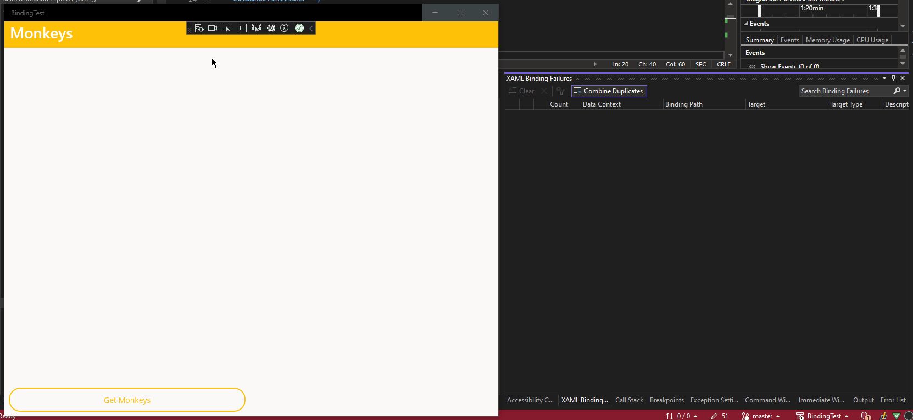

# BindingTest
Demonstrates a binding issue that seems to exist in in the dotnet 8 maui preview.

This project is essentially [dotnet-maui-workshop](https://github.com/dotnet-presentations/dotnet-maui-workshop) by [jamesmontemagno](https://github.com/jamesmontemagno) except it was created using dotnet 8.0.100-preview.6.23330.14.

I'm using this because this is almost exactly how I'm using the DataTemplate inside of a CollectionView in my actual project. 
In the main page you will see a CollectionView that uses an inline DataTemplate to present different properties of each monkey object. 
Run the application in debug mode and click the "Get Monkeys" button and you will see the data load and be presented correctly, however, there will also be multiple binding errors in the debugger. 
As far as I can tell all of the errors are saying that any given property in the Monkey.cs doesn't exist in MonkeysViewModel.cs. 
Now it's technically correct, those properties don't exist there, but, the in the DataTemplate I have `x:DataType="models:Monkey"`. 
So it should be looking in the Monkey.cs right? `¯\_(ツ)_/¯` I'm not even sure that functionality is being impacted, errors just scare me.

Here are the XAML Binding Failures:

| Severity | Count | Data Context | Binding Path | Target | Target Type | Description | File | Line | Project |
| ---      | ---   | ---          | ---          | ---    | ---         | ---         | ---  | ---  | ---     |
| Error | 13 | MonkeysViewModel | Image | Image.Source | ImageSource | 'Image' property not found on 'BindingTest.ViewModels.MonkeysViewModel', target property: 'Microsoft.Maui.Controls.Image.Source' | ...\BindingTest\Views\MainPage.xaml | 32 | BindingTest |
| Error | 13 | MonkeysViewModel | Name | Label.Text | String | 'Name' property not found on 'BindingTest.ViewModels.MonkeysViewModel', target property: 'Microsoft.Maui.Controls.Label.Text' | ...\BindingTest\Views\MainPage.xaml | 39 | BindingTest |
| Error | 13 | MonkeysViewModel | Location | Label.Text | String | 'Location' property not found on 'BindingTest.ViewModels.MonkeysViewModel', target property: 'Microsoft.Maui.Controls.Label.Text' | ...\BindingTest\Views\MainPage.xaml | 40 | BindingTest | 


Here is exactly what I'm seeing:


This little gif also shows off the current bug of the headers and footers not showing on Windows.

Finally here are the details on my installation:

Framework: net8.0-windows10.0.19041.0

```
Welcome to .NET 8.0!
---------------------
SDK Version: 8.0.100-preview.6.23330.14

...

Installed Workload Id      Manifest Version                               Installation Source
--------------------------------------------------------------------------------------------------------------
maui-windows               8.0.0-preview.6.8686/8.0.100-preview.6         VS 17.6.33829.357, VS 17.7.33913.275
maui-maccatalyst           8.0.0-preview.6.8686/8.0.100-preview.6         VS 17.6.33829.357, VS 17.7.33913.275
maui-ios                   8.0.0-preview.6.8686/8.0.100-preview.6         VS 17.6.33829.357, VS 17.7.33913.275
maccatalyst                16.4.8646-net8-p6/8.0.100-preview.6            VS 17.6.33829.357, VS 17.7.33913.275
ios                        16.4.8646-net8-p6/8.0.100-preview.6            VS 17.6.33829.357, VS 17.7.33913.275
maui-android               8.0.0-preview.6.8686/8.0.100-preview.6         VS 17.6.33829.357, VS 17.7.33913.275
android                    34.0.0-preview.6.359/8.0.100-preview.6         VS 17.6.33829.357, VS 17.7.33913.275
wasm-tools                 8.0.0-preview.6.23329.7/8.0.100-preview.6      VS 17.6.33829.357
```
